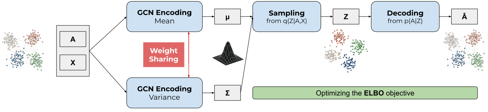

# Investigating Weight Sharing in VGAE

This repository contains Python code and data for reproducing the experiments described in the research article titled _"To Share or Not to Share: Investigating Weight Sharing in Variational Graph Autoencoders"_ by G. Salha-Galvan and J. Xu. This article is currently under review and will be made available online upon publication.

## Introduction

This paper investigates the understudied practice of **weight sharing (WS)** in **variational graph autoencoders (VGAE)**, a powerful family of unsupervised node embedding methods for Web-related applications. 
WS presents both benefits and drawbacks for VGAE model design and node embedding learning, leaving its overall relevance unclear and the question of whether it should be adopted unresolved. 

We rigorously analyze its implications and, through extensive experiments on a wide range of graphs and VGAE variants, demonstrate that the benefits of WS consistently outweigh its drawbacks. Based on our findings, we recommend WS as an effective approach to optimize, regularize, and simplify VGAE models without significant performance loss.

To encourage further research, we have made our source code publicly available in this GitHub repository. Our code builds upon the [FastGAE](https://github.com/deezer/fastgae) repository by [Deezer Research](https://github.com/deezer), which itself extends the original [Tensorflow implementation of VGAE models](https://github.com/tkipf/gae) by [Thomas Kipf](https://github.com/tkipf).

<p align="center">
  
</p>


## Installation

Please execute the following command lines to complete the installation.

```bash
git clone https://github.com/GuillaumeSalhaGalvan/ws_vgae
cd ws_vgae
python setup.py install
```

Requirements: Python 3.10, networkx 2.6, numpy 2.0.2, scikit-learn 1.5.2, scipy 1.14.1, tensorflow 2.18.


## Datasets

We provide direct access to all public datasets used in our experiments in the `data` folder.


## Run Experiments

### Quick tests:

Navigate to the `ws_vgae` folder.

```bash
cd ws_vgae
```

Train a **VGAE** model (20 training iterations only) on the Blogs dataset **with weight sharing (WS):**

```bash
python train.py --model=gcn_vae --dataset=blogs --learning_rate=0.01 --iterations=20
```

Train a **VGAE** model (20 training iterations only) on the Blogs dataset **without WS:**

```bash
python train.py --model=gcn_vae_nows --dataset=blogs --learning_rate=0.01 --iterations=20
```

### Reproduce experiments from Table 1 of the article:

Navigate to the `ws_vgae` folder, if needed.

```bash
cd ws_vgae
```

Train complete **VGAE** models **with WS** on all graph datasets:

```bash
python train.py --model=gcn_vae --dataset=cora --task=link_prediction --features=False  --learning_rate=0.01 --iterations=300 --nb_run=1
python train.py --model=gcn_vae --dataset=cora --task=link_prediction --features=True  --learning_rate=0.01 --iterations=300 --nb_run=1
python train.py --model=gcn_vae --dataset=citeseer --task=link_prediction --features=False  --learning_rate=0.01 --iterations=300 --nb_run=1
python train.py --model=gcn_vae --dataset=citeseer --task=link_prediction --features=True  --learning_rate=0.01 --iterations=300 --nb_run=1
python train.py --model=gcn_vae --dataset=pubmed --task=link_prediction --features=False  --learning_rate=0.01 --iterations=300 --nb_run=1 --fastgae --nb_node_samples=5000 --alpha=1
python train.py --model=gcn_vae --dataset=pubmed --task=link_prediction --features=True  --learning_rate=0.01 --iterations=300 --nb_run=1 --fastgae --nb_node_samples=5000 --alpha=1
python train.py --model=gcn_vae --dataset=webkd --task=link_prediction --features=False  --learning_rate=0.005 --iterations=300 --nb_run=1
python train.py --model=gcn_vae --dataset=webkd --task=link_prediction --features=True  --learning_rate=0.005 --iterations=300 --nb_run=1
python train.py --model=gcn_vae --dataset=blogs --task=link_prediction --features=False  --learning_rate=0.01 --iterations=200 --nb_run=1
python train.py --model=gcn_vae --dataset=hamster --task=link_prediction --features=False  --learning_rate=0.01 --iterations=300 --nb_run=1
python train.py --model=gcn_vae --dataset=arxiv-hep --task=link_prediction --features=False  --learning_rate=0.05 --iterations=300 --nb_run=1  --fastgae --nb_node_samples=5000 --alpha=1
python train.py --model=gcn_vae --dataset=cora-large --task=link_prediction --features=False  --learning_rate=0.01 --iterations=300 --nb_run=1  --fastgae --nb_node_samples=5000 --alpha=1
python train.py --model=gcn_vae --dataset=google-medium --task=link_prediction --features=False  --learning_rate=0.01 --iterations=300 --nb_run=1  --fastgae --nb_node_samples=5000 --alpha=1
python train.py --model=gcn_vae --dataset=google --task=link_prediction --features=False  --learning_rate=0.01 --iterations=300 --nb_run=1 --fastgae --nb_node_samples=5000 --alpha=1
python train.py --model=gcn_vae --dataset=sbm --task=link_prediction --features=False  --learning_rate=0.01 --iterations=300 --nb_run=1  --fastgae --nb_node_samples=5000 --alpha=1
```

Train complete **VGAE** models **without WS** on all graph datasets:

```bash
python train.py --model=gcn_vae_nows --dataset=cora --task=link_prediction --features=False  --learning_rate=0.01 --iterations=300 --nb_run=1
python train.py --model=gcn_vae_nows --dataset=cora --task=link_prediction --features=True  --learning_rate=0.01 --iterations=300 --nb_run=1
python train.py --model=gcn_vae_nows --dataset=citeseer --task=link_prediction --features=False  --learning_rate=0.01 --iterations=300 --nb_run=1
python train.py --model=gcn_vae_nows --dataset=citeseer --task=link_prediction --features=True  --learning_rate=0.01 --iterations=300 --nb_run=1
python train.py --model=gcn_vae_nows --dataset=pubmed --task=link_prediction --features=False  --learning_rate=0.01 --iterations=300 --nb_run=1 --fastgae --nb_node_samples=5000 --alpha=1
python train.py --model=gcn_vae_nows --dataset=pubmed --task=link_prediction --features=True  --learning_rate=0.01 --iterations=300 --nb_run=1 --fastgae --nb_node_samples=5000 --alpha=1
python train.py --model=gcn_vae_nows --dataset=webkd --task=link_prediction --features=False  --learning_rate=0.005 --iterations=300 --nb_run=1
python train.py --model=gcn_vae_nows --dataset=webkd --task=link_prediction --features=True  --learning_rate=0.005 --iterations=300 --nb_run=1
python train.py --model=gcn_vae_nows --dataset=blogs --task=link_prediction --features=False  --learning_rate=0.01 --iterations=200 --nb_run=1
python train.py --model=gcn_vae_nows --dataset=hamster --task=link_prediction --features=False  --learning_rate=0.01 --iterations=300 --nb_run=1
python train.py --model=gcn_vae_nows --dataset=arxiv-hep --task=link_prediction --features=False  --learning_rate=0.05 --iterations=300 --nb_run=1  --fastgae --nb_node_samples=5000 --alpha=1
python train.py --model=gcn_vae_nows --dataset=cora-large --task=link_prediction --features=False  --learning_rate=0.01 --iterations=300 --nb_run=1  --fastgae --nb_node_samples=5000 --alpha=1
python train.py --model=gcn_vae_nows --dataset=google-medium --task=link_prediction --features=False  --learning_rate=0.01 --iterations=300 --nb_run=1  --fastgae --nb_node_samples=5000 --alpha=1
python train.py --model=gcn_vae_nows --dataset=google --task=link_prediction --features=False  --learning_rate=0.01 --iterations=300 --nb_run=1 --fastgae --nb_node_samples=5000 --alpha=1
python train.py --model=gcn_vae_nows --dataset=sbm --task=link_prediction --features=False  --learning_rate=0.01 --iterations=300 --nb_run=1  --fastgae --nb_node_samples=5000 --alpha=1
```

Train complete **Deep VGAE** models **with WS** on all graph datasets:
```bash
python train.py --model=deep_gcn_vae --dataset=cora --task=link_prediction --features=False  --learning_rate=0.01 --iterations=300 --nb_run=1
python train.py --model=deep_gcn_vae --dataset=cora --task=link_prediction --features=True  --learning_rate=0.01 --iterations=300 --nb_run=1
python train.py --model=deep_gcn_vae --dataset=citeseer --task=link_prediction --features=False  --learning_rate=0.01 --iterations=300 --nb_run=1
python train.py --model=deep_gcn_vae --dataset=citeseer --task=link_prediction --features=True  --learning_rate=0.01 --iterations=300 --nb_run=1
python train.py --model=deep_gcn_vae --dataset=pubmed --task=link_prediction --features=False  --learning_rate=0.01 --iterations=300 --nb_run=1 --fastgae --nb_node_samples=5000 --alpha=1
python train.py --model=deep_gcn_vae --dataset=pubmed --task=link_prediction --features=True  --learning_rate=0.01 --iterations=300 --nb_run=1 --fastgae --nb_node_samples=5000 --alpha=1
python train.py --model=deep_gcn_vae --dataset=webkd --task=link_prediction --features=False  --learning_rate=0.005 --iterations=300 --nb_run=1
python train.py --model=deep_gcn_vae --dataset=webkd --task=link_prediction --features=True  --learning_rate=0.005 --iterations=300 --nb_run=1
python train.py --model=deep_gcn_vae --dataset=blogs --task=link_prediction --features=False  --learning_rate=0.01 --iterations=200 --nb_run=1
python train.py --model=deep_gcn_vae --dataset=hamster --task=link_prediction --features=False  --learning_rate=0.01 --iterations=300 --nb_run=1
python train.py --model=deep_gcn_vae --dataset=arxiv-hep --task=link_prediction --features=False  --learning_rate=0.05 --iterations=300 --nb_run=1  --fastgae --nb_node_samples=5000 --alpha=1
python train.py --model=deep_gcn_vae --dataset=cora-large --task=link_prediction --features=False  --learning_rate=0.01 --iterations=300 --nb_run=1  --fastgae --nb_node_samples=5000 --alpha=1
python train.py --model=deep_gcn_vae --dataset=google-medium --task=link_prediction --features=False  --learning_rate=0.01 --iterations=300 --nb_run=1  --fastgae --nb_node_samples=5000 --alpha=1
python train.py --model=deep_gcn_vae --dataset=google --task=link_prediction --features=False  --learning_rate=0.01 --iterations=300 --nb_run=1  --fastgae --nb_node_samples=5000 --alpha=1
python train.py --model=deep_gcn_vae --dataset=sbm --task=link_prediction --features=False  --learning_rate=0.01 --iterations=300 --nb_run=1  --fastgae --nb_node_samples=5000 --alpha=1
```

Train complete **Deep VGAE** models **without WS** on all graph datasets:
```bash
python train.py --model=deep_gcn_vae_nows --dataset=cora --task=link_prediction --features=False  --learning_rate=0.01 --iterations=300 --nb_run=1
python train.py --model=deep_gcn_vae_nows --dataset=cora --task=link_prediction --features=True  --learning_rate=0.01 --iterations=300 --nb_run=1
python train.py --model=deep_gcn_vae_nows --dataset=citeseer --task=link_prediction --features=False  --learning_rate=0.01 --iterations=300 --nb_run=1
python train.py --model=deep_gcn_vae_nows --dataset=citeseer --task=link_prediction --features=True  --learning_rate=0.01 --iterations=300 --nb_run=1
python train.py --model=deep_gcn_vae_nows --dataset=pubmed --task=link_prediction --features=False  --learning_rate=0.01 --iterations=300 --nb_run=1 --fastgae --nb_node_samples=5000 --alpha=1
python train.py --model=deep_gcn_vae_nows --dataset=pubmed --task=link_prediction --features=True  --learning_rate=0.01 --iterations=300 --nb_run=1 --fastgae --nb_node_samples=5000 --alpha=1
python train.py --model=deep_gcn_vae_nows --dataset=webkd --task=link_prediction --features=False  --learning_rate=0.005 --iterations=300 --nb_run=1
python train.py --model=deep_gcn_vae_nows --dataset=webkd --task=link_prediction --features=True  --learning_rate=0.005 --iterations=300 --nb_run=1
python train.py --model=deep_gcn_vae_nows --dataset=blogs --task=link_prediction --features=False  --learning_rate=0.01 --iterations=200 --nb_run=1
python train.py --model=deep_gcn_vae_nows --dataset=hamster --task=link_prediction --features=False  --learning_rate=0.01 --iterations=300 --nb_run=1
python train.py --model=deep_gcn_vae_nows --dataset=arxiv-hep --task=link_prediction --features=False  --learning_rate=0.05 --iterations=300 --nb_run=1  --fastgae --nb_node_samples=5000 --alpha=1
python train.py --model=deep_gcn_vae_nows --dataset=cora-large --task=link_prediction --features=False  --learning_rate=0.01 --iterations=300 --nb_run=1  --fastgae --nb_node_samples=5000 --alpha=1
python train.py --model=deep_gcn_vae_nows --dataset=google-medium --task=link_prediction --features=False  --learning_rate=0.01 --iterations=300 --nb_run=1  --fastgae --nb_node_samples=5000 --alpha=1
python train.py --model=deep_gcn_vae_nows --dataset=google --task=link_prediction --features=False  --learning_rate=0.01 --iterations=300 --nb_run=1  --fastgae --nb_node_samples=5000 --alpha=1
python train.py --model=deep_gcn_vae_nows --dataset=sbm --task=link_prediction --features=False  --learning_rate=0.01 --iterations=300 --nb_run=1  --fastgae --nb_node_samples=5000 --alpha=1
```

### Notes:
* The above commands execute a single training run for each model. Use the `--nb_run` parameter to average scores over multiple training runs.
* The above commands evaluate models on the link prediction task. To switch to community detection, replace `--task=link_prediction` with `--task=community_detection`.
* Some of the above commands include `--fastgae` to leverage the [FastGAE](https://arxiv.org/pdf/2002.01910.pdf) technique for scalability.
* A complete list of parameters is available in the `train.py` file.


## On VGAE Model Variants

This repository currently provides complete instructions for the VGAE and Deep VGAE models.

To run similar experiments on the other model variants mentioned in Table 2 of the article, simply incorporate the WS/no WS distinctions from our own `model.py` file into the `model.py` files of the following repositories: 
* [ARGVA](https://github.com/TrustAGI-Lab/ARGA/);
* [Graphite-VGAE](https://github.com/ermongroup/graphite);
* [G-VGAE](https://github.com/deezer/gravity_graph_autoencoders);
* [MA-VGAE](https://github.com/GuillaumeSalhaGalvan/modularity_aware_gae).

## Citation

To be added.

More complete implementations for these variants will be made available by the publication date of the article, along with Python commands with all optimal hyperparameters for these variants.
